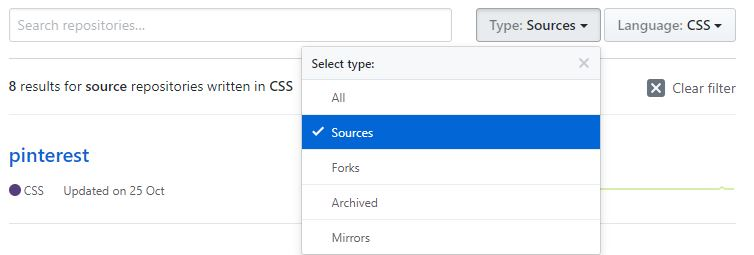

# Github
### Navegación global

### Navegación en línea
![En línea 1][1]  ![En línea 2][2]
[1]:assets/docs/github/enlinea1.jpg
[2]:assets/docs/github/enlinea2.jpg
### Navegación facetada

### Navegación local

### Navegación filtrada

